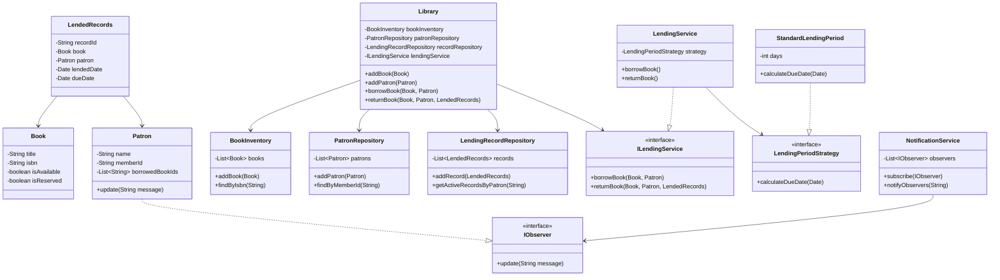

# Library Management System - Class Diagram

```mermaid
classDiagram
    %% Core Facade
    class Library {
        -BookInventory bookInventory
        -PatronRepository patronRepository
        -LendingRecordRepository recordRepository
        -ILendingService lendingService
        +addBook(Book)
        +addPatron(Patron)
        +borrowBook(Book, Patron)
        +returnBook(Book, Patron, LendedRecords)
    }

    %% Data Models
    class Book {
        -String title
        -String isbn
        -boolean isAvailable
        -boolean isReserved
    }

    class Patron {
        -String name
        -String memberId
        -List~String~ borrowedBookIds
        +update(String message)
    }

    class LendedRecords {
        -String recordId
        -Book book
        -Patron patron
        -Date lendedDate
        -Date dueDate
    }

    %% Repositories (SRP)
    class BookInventory {
        -List~Book~ books
        +addBook(Book)
        +findByIsbn(String)
    }

    class PatronRepository {
        -List~Patron~ patrons
        +addPatron(Patron)
        +findByMemberId(String)
    }

    class LendingRecordRepository {
        -List~LendedRecords~ records
        +addRecord(LendedRecords)
        +getActiveRecordsByPatron(String)
    }

    %% Services & Strategies (OCP, DIP)
    class ILendingService {
        <<interface>>
        +borrowBook(Book, Patron)
        +returnBook(Book, Patron, LendedRecords)
    }

    class LendingService {
        -LendingPeriodStrategy strategy
        +borrowBook()
        +returnBook()
    }

    class LendingPeriodStrategy {
        <<interface>>
        +calculateDueDate(Date)
    }

    class StandardLendingPeriod {
        -int days
        +calculateDueDate(Date)
    }

    %% Observer Pattern
    class IObserver {
        <<interface>>
        +update(String message)
    }

    class NotificationService {
        -List~IObserver~ observers
        +subscribe(IObserver)
        +notifyObservers(String)
    }

    %% Relationships
    Library --> BookInventory
    Library --> PatronRepository
    Library --> LendingRecordRepository
    Library --> ILendingService
    
    LendingService ..|> ILendingService
    LendingService --> LendingPeriodStrategy
    StandardLendingPeriod ..|> LendingPeriodStrategy
    
    Patron ..|> IObserver
    NotificationService --> IObserver
    
    LendedRecords --> Book
    LendedRecords --> Patron
```
